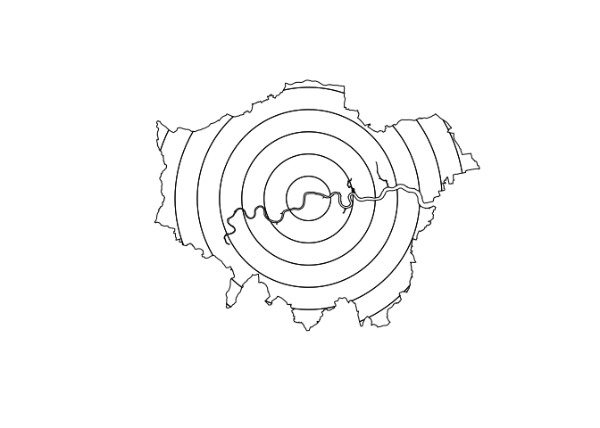

<!-- README.md is generated from README.Rmd. Please edit that file -->

# zonebuilder

<!-- badges: start -->

<!-- badges: end -->

The goal of zonebuilder is to …

## Installation

You can install the released version of zonebuilder from
[CRAN](https://CRAN.R-project.org) with:

``` r
install.packages("zonebuilder")
```

And the development version from [GitHub](https://github.com/) with:

``` r
# install.packages("devtools")
devtools::install_github("robinlovelace/zonebuilder")
```

## Example

``` r
library(sf)
#> Linking to GEOS 3.8.0, GDAL 3.0.2, PROJ 6.2.1
devtools::load_all()
#> Loading zonebuilder
plot(zb_region)
```


The aim is to be able to break up geographical space into discrete
chunks. The syntax is designed to be user friendly, e.g.:

``` r
x = zb_region
q = zb_quadrat(x, 4) # break into 4
plot(q)
```


Or doughnuts

``` r
plot(zb_doughnut(x, n = 4))
```


``` r
doughnut_4km = zb_doughnut(x, d = 4)
doughnut_4km
#> Simple feature collection with 8 features and 0 fields
#> geometry type:  GEOMETRY
#> dimension:      XY
#> bbox:           xmin: 503458.6 ymin: 155907.5 xmax: 561840.6 ymax: 200985.4
#> epsg (SRID):    27700
#> proj4string:    +proj=tmerc +lat_0=49 +lon_0=-2 +k=0.9996012717 +x_0=400000 +y_0=-100000 +ellps=airy +units=m +no_defs
#>   sf..st_intersection.x..doughnuts.
#> 1  MULTIPOLYGON (((535049.7 18...
#> 2  MULTIPOLYGON (((538984.3 18...
#> 3  MULTIPOLYGON (((543099.1 17...
#> 4  MULTIPOLYGON (((546930.3 18...
#> 5  POLYGON ((528333.1 159903.3...
#> 6  MULTIPOLYGON (((534895.7 15...
#> 7  MULTIPOLYGON (((517141.3 16...
#> 8  MULTIPOLYGON (((504453.2 18...
plot(sf::st_geometry(doughnut_4km))
plot(doughnut_4km[3, ], col = "blue", add = TRUE)
```


