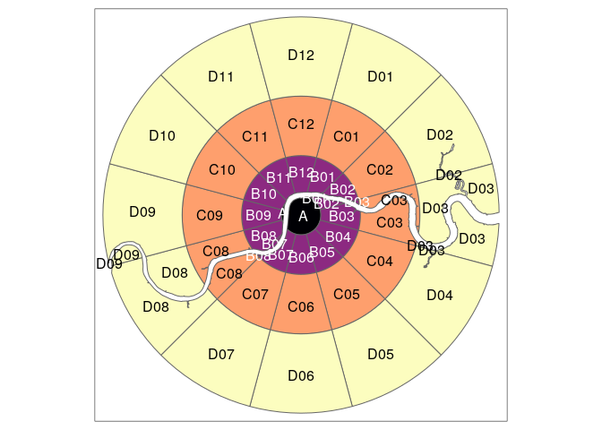

<!-- README.md is generated from README.Rmd. Please edit that file -->

# zonebuilder

<!-- badges: start -->

[](https://travis-ci.org/zonebuilders/zonebuilder)
<!-- badges: end -->

The goal of zonebuilder is to break up large geographic regions such as
cities into manageable zones. Zoning systems are important in many
fields, including transport planning, where we hope to use the zones
generated by `zonebuilder` to build the evidence base needed to enable
uptake of healthy modes of transport like walking, cycling and renewable
electricity-powered public transport. See its website at
[zonebuilders.github.io/zonebuilder](https://zonebuilders.github.io/zonebuilder/).

## Installation

<!-- You can install the released version of zonebuilder from [CRAN](https://CRAN.R-project.org) with: -->

Install it from [GitHub](https://github.com/) with:

``` r
# install.packages("devtools")
devtools::install_github("robinlovelace/zonebuilder")
```

## Using zonebuilder

Zonebuilder works with `sf` objects and works well alongside the `sf`
package and visualisation packages that support spatial data such as
`ggplot2`, `leaflet`, `mapdeck`, `mapview` and `tmap`, the last of which
we’ll use in the following maps. Attaching the package provides the
example dataset `zb_region`, the geographic boundary of a large city
(London, UK):

``` r
library(zonebuilder)
library(tmap)
tmap_border = tm_shape(zb_region) + tm_borders()
tmap_border
```


The core functions in the package break up geographical space into
discrete chunks. The syntax is designed to be user friendly. The
following command, for example, breaks London into quadrats of equal
size (and keeping only the space inside the boundary):

``` r
x = zb_region
q = zb_quadrat(x, ncol = 4) # break into 4
qtm(q) 
```


Another zoning option is ‘doughnuts’:

``` r
tmap_arrange(
  qtm(zb_doughnut(x, n_circles = 3)) + tmap_border,
  qtm(zb_doughnut(x, distance = 3)) + tmap_border
)
#> Set distance to enable distance_growth
```


A new zoning system implemented in the function `zb_zone()` segments
doughnuts of gradually increasing width to create concentric segmented
annuli (CSA):

``` r
library(zonebuilder)
x = zb_region
z = zb_zone(x)
z
#> Simple feature collection with 76 features and 3 fields
#> geometry type:  GEOMETRY
#> dimension:      XY
#> bbox:           xmin: 503458.6 ymin: 155907.5 xmax: 561840.6 ymax: 200985.4
#> epsg (SRID):    27700
#> proj4string:    +proj=tmerc +lat_0=49 +lon_0=-2 +k=0.9996012717 +x_0=400000 +y_0=-100000 +ellps=airy +units=m +no_defs
#> First 10 features:
#>    circle_id segment_id label                       geometry
#> 1          1         01     A MULTIPOLYGON (((532101.7 17...
#> 2          2         01   B01 MULTIPOLYGON (((531808.8 18...
#> 3          2         02   B02 MULTIPOLYGON (((532067.6 17...
#> 4          2         03   B03 MULTIPOLYGON (((534101.7 17...
#> 5          2         04   B04 POLYGON ((533999.5 178928, ...
#> 6          2         05   B05 POLYGON ((533223 177583.2, ...
#> 7          2         06   B06 POLYGON ((531878.2 176806.7...
#> 8          2         07   B07 MULTIPOLYGON (((530325.3 17...
#> 9          2         08   B08 MULTIPOLYGON (((528980.4 17...
#> 10         2         09   B09 POLYGON ((528203.9 178928, ...
qtm(z)
```


This function gives you control over a number of parameters, as
documented in the help pages and an in-progress academic paper.

``` r
args(zb_zone)
#> function (x = NULL, point = NULL, n_circles = NULL, n_segments = 12, 
#>     distance = 1, distance_growth = 1, starting_angle = 15, segment_center = FALSE, 
#>     intersection = TRUE) 
#> NULL
```

The zones are labeled by default in the following way. The rings are
labels with capital letters, where A is the centre. The segments are
numbers using clock hours, so 12, 3, 6, and 9 for north, east, south,
west respectivly.

``` r
z = zb_zone(x, n_circles = 4)
tm_shape(z) +
  tm_polygons(col = "circle_id", legend.show = FALSE, palette = "magma") + 
  tm_text("label")
```


