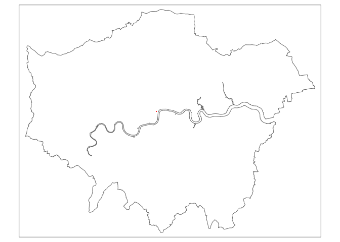
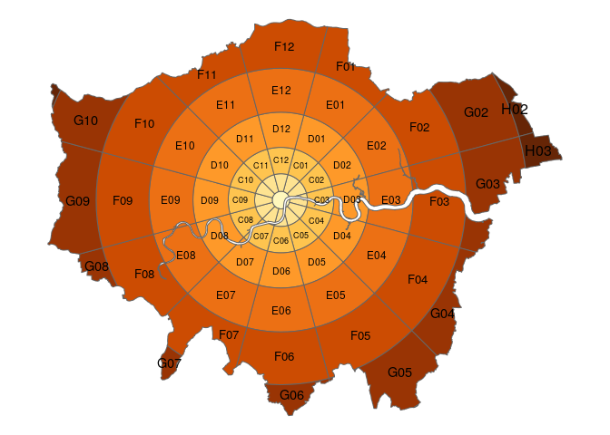
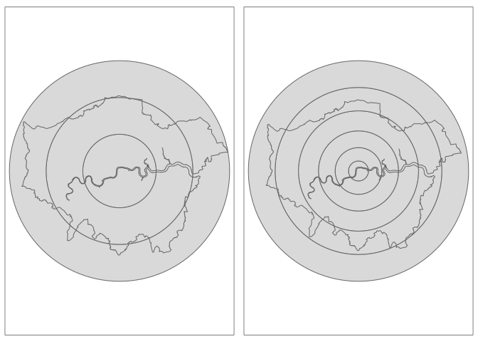
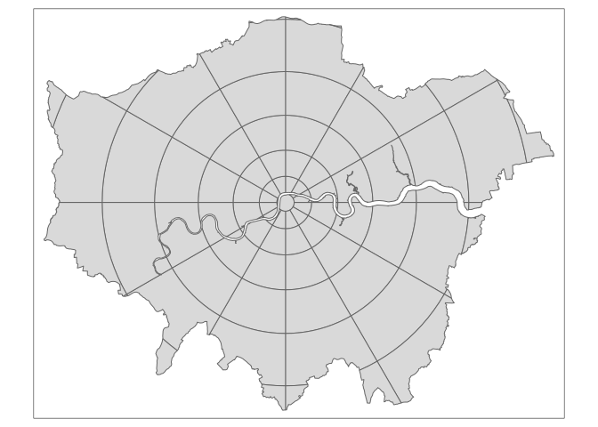

<!-- README.md is generated from README.Rmd. Please edit that file -->

# zonebuilder

<!-- badges: start -->

<!-- badges: end -->

The goal of zonebuilder is to break up large regions into manageable
zones for research and applied transport planning, to support the global
transition away from fossil fuels in the transport sector, and towards
more healthy modes of transport like walking, cycling and renewable
electricity-powered public
transport.

## Installation

<!-- You can install the released version of zonebuilder from [CRAN](https://CRAN.R-project.org) with: -->

Install it from [GitHub](https://github.com/) with:

``` r
# install.packages("devtools")
devtools::install_github("robinlovelace/zonebuilder")
```

## Using zonebuilder

Zonebuilder works with `sf` objects and works well alongside the `sf`
package and visualisation packages that support spatial data such as
`ggplot2`, `leaflet`, `mapdeck`, `mapview` and `tmap`, the last of which
we’ll use in the following maps. Attaching the package provides the
example dataset `zb_region`, the geographic boundary of a large city
(London, UK):

``` r
library(zonebuilder)
library(tmap)
tmap_border = tm_shape(zb_region) + tm_borders()
tmap_border
```



The core functions in the package break up geographical space into
discrete chunks. The syntax is designed to be user friendly. The
following command, for example, breaks London into quadrats of equal
size (and keeping only the space inside the boundary):

``` r
x = zb_region
q = zb_quadrat(x, ncol = 4) # break into 4
qtm(q) 
```



Another zoning option is ‘doughnuts’:

``` r
tmap_arrange(
  qtm(zb_doughnut(x, n_circles = 3)) + tmap_border,
  qtm(zb_doughnut(x, distance = 3)) + tmap_border
)
#> Set distance to enable distance_growth
```



A new zoning system implemented in the function `zb_zone()` segments
doughnuts of gradually increasing width to create concentric segmented
annuli (CSA):

``` r
qtm(zb_zone(x))
```



This function gives you control over a number of parameters, as
documented in the help pages and an in-progress academic paper.

``` r
args(zb_zone)
#> function (x = NULL, point = NULL, n_circles = NULL, n_segments = 12, 
#>     distance = 1, distance_growth = 1, segment_center = FALSE, 
#>     intersection = TRUE) 
#> NULL
```
