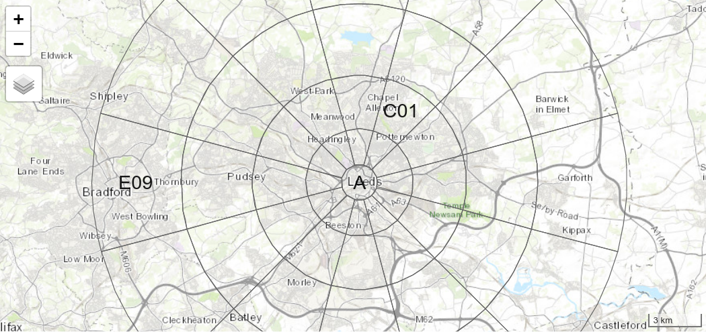

```{r, include = FALSE}
knitr::opts_chunk$set(
  fig.align = "center",
  eval = TRUE, # set to false for CRAN submission
  echo = FALSE,
  collapse = TRUE,
  comment = "#>",
  message = FALSE,
  warning = FALSE
  # , cache = TRUE
)
library(zonebuilder)
library(tmap)
library(dplyr)
```

```{r, eval=FALSE}
# To uses josis template:
remotes::install_github("robinlovelace/rticles", ref = "josis")
refs = RefManageR::ReadZotero(group = "418217", .params = list(collection = "8S8LR8TK", limit = 100))
RefManageR::WriteBib(refs, "vignettes/references.bib")
u = "www.zotero.org/styles/open-geospatial-data-software-and-standards"
download.file(u, "vignettes/josis.csl")
piggyback::pb_upload("cities_p1.png")
piggyback::pb_upload("cities_p2-scale.png")
piggyback::pb_download_url("cities_p1.png")
# [1] "https://github.com/zonebuilders/zonebuilder/releases/download/v0.0.2.9000/cities_p1.png"

# Set-up notes for pdf version
# convert .tex to .md
# system("pandoc -s -r latex paper.tex -o paper.md")
# # copy josis specific files and ignore them
# f = list.files("~/other-repos/rticles/inst/rmarkdown/templates/josis/skeleton", pattern = "josis", full.names = TRUE)
# file.copy(f, "vignettes")
rmarkdown::render(input = "vignettes/paper.Rmd", output_file = "zonebuilder-paper.pdf")
file.rename("vignettes/zonebuilder-paper.pdf", "zonebuilder-paper.pdf")
browseURL("zonebuilder-paper.pdf")
piggyback::pb_upload("zonebuilder-paper.pdf")
piggyback::pb_upload("vignettes/zonebuilder-paper.tex")
piggyback::pb_download("vignettes/zonebuilder-paper.tex")
piggyback::pb_download_url("zonebuilder-paper.pdf")
# [1] "https://github.com/zonebuilders/zonebuilder/releases/download/v0.0.2.9000/zonebuilder-paper.pdf"

remotes::install_github("paleolimbot/rbbt")
# library(rbbt)
# rbbt::bbt_update_bib(path_rmd = "vignettes/paper.Rmd")

# Create diff file
wd_old = setwd("vignettes")
piggyback::pb_download("vignettes.zonebuilder-paper.tex")
system("latexdiff -h")
rmarkdown::render("paper.Rmd")
system("latexdiff vignettes.zonebuilder-paper.tex paper.tex > diff.tex")
tinytex::pdflatex("diff.tex")
browseURL("diff.pdf")
piggyback::pb_upload("diff.pdf")
piggyback::pb_download_url("diff.pdf")
setwd(wd_old)
```

# Introduction

Zoning is the process of generating areal units for aggregating, visualising, and potentially modelling geographic datasets.
The resulting zones --- also commonly referred to as 'areal units' or 'small areas' in the literature --- have long been used to support analysis of human systems.
Historical examples highlighting the importance of zone layouts include 'tithe maps' determining land ownership and taxes in 18th Century England [@bryant_worcestershire_2007] and the division of cities into discrete areas including legally defined "business, industrial, and residential zones" to tame chaotic urban growth in the exploding US cities in the early 1900s [@baker_zoning_1925].

In the 19th Century, zoning systems became known for political reasons, with 'gerrymandering' entering public discourse and academic research following Elbridge Gerry's apparent attempt to gain political advantage by creating an electoral district in an odd shape that was said to resemble a salamander (hence the term's name combining 'Gerry' and 'salamander') in 1812 [@orr_persistence_1969].
Gerrymandering has since been the topic of countless academic papers that is the beyond the scope of the present paper.

Research has made great progress in mathematical analysis of zones and more objective assessment of the impacts that the nature of zoning systems can have on zone-based statistics (such as number of votes for a particular party in each zone) and outcomes.
The gerrymandering problem is a manifestation of the modifiable area unit problem (MAUP), can be described as a mathematical optimization problem: "$n$ units are grouped into $k$ zones such that some cost function is optimized, subject to constraints on the topology of the zones" [@chou_taming_2006].
Our aim in this paper is not to tackle the MAUP directly, but to provide a 'ready made' zoning system that can demonstrate some of its effects by providing another way to aggregate and present data.

Prior work has demonstrated the sensitivity of urban analysis outcomes to zone system design, from the way cities are visualised to the [impact of the nature of 'traffic analysis zones' on transport model outputs](http://www.iasi.cnr.it/ewgt/13conference/145_binetti.pdf). 
In fact, this problem is a concise definition of the broader "zoning problem" that starts from the assumption that zones are to be composed of one or more basic statistical units (BSUs) [@jelinski_modifiable_1996; @chandra_multi-objective_2021].
Although the range of outcomes is a finite combinatorial optimization problem (which combination of BSU-zone aggregations satisfy/optimize some pre-determined criteria), the zoning problem is still hard: "there are a tremendously large number of alternative partitions, a similar number of different results, and only a slightly smaller number of different interpretations" [@openshaw_optimal_1977].

Pre-existing zoning systems are often based on administrative regions and reflect the hierarchical organizational structure of statistical agencies.
Well-designed administrative zones are advantageous for many applications, especially in relation to aggregated administrative datasets, but have disadvantages for certain applications.
First, the administrative regions often change over time, hindering spatio-temporal analysis.
Second, since the administrative zones have different sizes and shapes in different cities, they may not be ideal when comparing cities.
In order to address these shortcomings of zoning systems based on administrative regions, our aim in this paper is to build a zoning system from scratch, i.e. to divide a *continuous* geographic space into zones **starting from a blank slate**.

The focus of much preceding zoning research on BSU partitioning can be explained by the fact that much geographic data available to academics comes in 'pre-packaged' small areas and because creating zones from nothing is a harder problem.
The statement that "existence of individual or non-spatially aggregated data is rare in geography", used by @openshaw_optimal_1977 to justify the BSU grouping approach, may have been true in the 1970s when it was written.
Today disaggregated geographic datasets are common.
Open datasets exist on phenomena including car crashes, shop locations, species identification data and dozens of other phenomena that can be understood as 'point pattern processes'.
And with advances in computer hardware and software, the 'starting from scratch' approach to zoning systems is more feasible.

A number of approaches have tackled the question of how to best divide up geographical space for analysis and visualization purposes, with a variety of applications.
Functional zone classification is common in the field of remote sensing and associated sub-fields involved in analysing and classifying raster datasets [@ciglic_evaluating_2019; @hesselbarth_landscapemetrics_2019].
While such pixel-based approaches can yield complex and flexible results (depending on the geographic resolution of the input data), they are still constrained by the building blocks of the pixels, which can be seen as a particular type of areal unit, a uniformly sized and shaped BSU.
Approaches to creating zoning systems *starting from* origin-destination have also been developed [@zhang_detecting_2021] and, although these approaches tend also to start from BSUs, they could be extended to generate 'bottom up' datasets starting from individual-level GPS type datasets. 

In this paper we are interested in the division of *continuous space* into completely new areal systems.
This has been done using lines representing points with equal journey time from locations (isochrones) and the areas bound by them [@long_modeling_2018], population density (isopleths) [@lin_cartographic_2017] and model parameters which continuous geographical space [@paez_exploring_2006].
The boundaries created by these various 'iso' maps are 'procedurally generated' areal units of the type that this paper focuses, but their variability and often irregular shapes make them impractical for many types of urban analysis.

Procedural generation, which involves the generation of data through a repeated and sometimes randomized computational process has long been used to represent physical phenomena [@onrust_ecologically_2017]. The approach has been used to generate spatial entities including roads [@galin_procedural_2010], indoor layouts of buildings [@anderson_augmented_2018] and urban layouts [@mustafa_procedural_2020]. Algorithms have also been developed to place linear features on a map, as illustrated by an algorithm that optimizes the placement of overlapping linear features for cartographic visualisation [@teulade-denantes_routes_2015].
However, no previous research has demonstrated the creation of zoning systems specifically for the purposes of urban analysis.

New visualisation techniques are needed to represent new (or newly quantifiable) concepts and emerging datasets (such as OpenStreetMap) in urban analysis.
The visualisation of direction has been driven by new navigational requirements and datasets, with circular compasses and displays common in land and sea navigational systems since the mid 1900s [@honick_pictorial_1967]. Circular visualisation techniques, in the form of rose diagrams, were used in a more recent study to indicate the most common road directions relative to North [@boeing_spatial_2021]. The resulting visualisations are attractive and easy to interpret, but are not geographical, in the sense that they cannot meaningfully be overlaid on mapped data. 

The approach we present in this paper is more closely analogous to 'grid sample' approaches used in ecological and population research [@hirzel_which_2002] . Historically, environmental researchers have used rectangular (and usually square) grids to divide up space and decide sampling strategies. Limitations associated with this simplistic strategy have been documented since at least the 1960s, with a prominent paper on geographic sampling strategies outlining advantages and disadvantages of simple random, systematic and stratified sampling techniques in 1967 [@holmes_problems_1967]. Starting with data at the level of raster grid cells and BSUs, a related approach is to sample from within available 'pixels' to generate a representative sample [@thomson_gridsample_2017].

Unlike BSU based zoning systems, the use of rectangular grids or 'quadrats' was common [@holmes_problems_1967].
The approach was particularly useful before administrative zones became widespread.
Unlike 'procedurally generated' areas, grid-based strategies generate areal units of consistent sizes and shapes.
However, grid-based strategies are limited in their applicability to urban research because they seldom generate geographically contiguous results and do not account for the strong tendency of human settlements to have a (more-or-less clearly demarcated) central location with higher levels of activity.

However, grid tiles are popular in spatial statistics for a number of reasons.
Most importantly the tiles have a constant area size, which makes comparably possible; specifying the lines that define them ensures that they do not change over time, unlike administrative regions.
Like the zoning system presented in this paper, grid tiles depend on a CRS and may become distorted over large (continental) spatial scales (this is not much of an issue for zoning systems that only aim to provide zones for a single city at a time like that presented here).
Another downside from a statistical perspective is that population density tends to increase towards a central point.
As a consequence, smaller zones are often preferable in denser areas, which often means towards the city center: for this reason administrative regions are often smaller in central areas and larger on the outskirts of cities, as illustrated with reference to London in Figure \@ref(fig:cityscale).

The overall aim of this paper is to highlight the potential for new zoning systems to support urban analysis.
We do this by presenting a zoning system that enables inter-city comparison using zones of the same size and shape regardless of the city's location, which can be generated rapidly and reproducibly with minimal data requirements.
The specific motivations for embarking on the idea, and its implementation in open source software, were as follows:

-   Locating phenomena in cities.
    Automated zoning systems based on a clear centerpoint can support map interpretation by making it immediately clear where the city center is, and what the scale of the city is.

-   Reference system for everyday life.
    The zone name contains information about the distance to the center as well as the cardinal direction.
    E.g "I live in C12 and work in B3." or "The train station is in the center and our hotel is in B7".
    Moreover, the zones indicate whether walking and cycling is a feasible option regarding the distance.

-   Aggregation for descriptive statistics.
    It is often useful or necessary to present geographical data in an aggregate form.
    A consistently sized and shaped set of zones can support attractive, clear and meaningful visualisation.

-   Comparing cities.
    By using the zoning system to aggregate statistics (e.g. on population density, air quality, bicycle use, number of dwellings), cities can easily be compared.

The paper is structured as follows.
The next section outlines the approach, which requires only 2 inputs: the coordinates of the central place in the urban system under investigation, and the minimum radius from that central point that the zoning system should extend.
Section 3 describes a number of potential applications, ranging from rudimentary navigation and location identification to mobility analysis.
Finally, in Section 4, we discuss limitations of the approach and possible directions of research and development to generate additional zoning systems for urban analysis.

# The ClockBoard zoning system {#clockzs}

The aim of the ClockBoard zoning system is to tackle the issues associated with available zoning systems and to provide a standard template for research and communication purposes.
<!-- and comparison of the geographic distribution of urban phenomena between cities internationally. -->
<!-- As outlined above, there is a need for open access zoning systems that are readily available and consistent. -->
The requirements of urban analysts, geographers, transport modellers and others working with geographic data across cities are diverse, but all rely on zoning systems as a foundation for modelling and visualisation.
To enable flexibility, and to encourage other zoning systems building on it, the ClockBoard zoning system described in this paper is presented as a specific implementation of a more general concept (segmented concentric annuli) and implemented in open source software which can be extended in a range of ways (see Discussion).
Considering urban analysis, modelling and wider research, visualisation and communication requirements of zoning systems, we developed the following criteria for successful zoning systems.
Zoning systems for urban analysis should:

-   contain intuitively named zones, enabling public communication of research, e.g. with reference common perceptions of space in terms of distance from the city center and direction relative to North
-   have a well-balanced number of zones since too many or too few zones may cause issues with analysis and visualisation
be easy to visualise without too many or too few zones
-   include zones of consistent and useful sizes, for example with zone areas increasing with distance from the urban centers to reflect relatively high densities in central locations
-   be 'scale agnostic', capable of representing a range of urban forms ranging from extensive cities such as Mexico City to compact cities such as Hong Kong
-   be extensible and based on open source software, enabling others to create alternative zoning systems suited to diverse needs

Considering the above criteria, we explored many zoning options, some of which are illustrated in Figure \@ref(fig:options).
Two key concepts that make up the zoning system described in this paper are concentric annuli and segments defined by radii.

- **Concentric rings** --- formally called 'concentric annuli' --- which emphasise central locations and have been used to explore the relationships between the characteristics of 'focal trees' and surrounding trees in ecological research [@wills_persistence_2016], as shown in Figure \@ref(fig:options) (A).

- **Segments**, defined by radial lines emanating from the central point of the settlement (or other geographic entity) to be divided into zones, as shown in Figure \@ref(fig:options) (B).

Combining these two concepts creates a general approach to zone creation that can be described as 'segmented concentric annuli', an implementation of which that we considered early in the process of designing the ClockBoard system with roughly equally sized zones (not the ClockBoard system) is shown in Figure \@ref(fig:options) (C).
After a period of informal testing and feedback that lasted approximately six months, we developed and refined the 'ClockBoard' zoning system presented in this paper, which is a specific implementation of the segmented concentric annuli approach to zone creation.

The parameters that define the ClockBoard zoning system were developed in an iterative process.
We experimented with a range of ways of dividing the concentric annuli into different zones by modifying the distances between rings (the annuli borders) and the number of segments per annulus.
It became apparent that zoning systems based on the two organising principles (and modifiable parameters) of concentric annuli and segments held promise, but selecting appropriate settings for each was key to the development of the ClockBoad zoning system, as outlined below.
<!-- commented out the next sentence as it's kind of obvious -->
<!-- The key parameters of annuli distances and number of segments are discussed below. -->


```{r options, fig.cap="Illustration of ideas explored in the lead-up to the development of the ClockBoard zoning system, highlighting the incremental and iterative evolution of the approach.", out.width="32%", fig.show='hold'}
# z1 = zb_zone(x = london_c(), n_segments = 1)
# m1 = qtm(z1, title = "(A) Concentric Annuli")
# sf::sf_use_s2(use_s2 = FALSE)
z1 = zb_zone(london_c(), n_segments = 1, distance_growth = 0)
z1_areas = sf::st_area(z1)
z1_areas_relative = as.numeric(z1_areas / z1_areas[1])
qtm(z1, title = "(A) Concentric Annuli", fill = NULL) +
  tm_layout(frame = FALSE, inner.margins = c(0.02, 0.02, 0.08, 0.02))
qtm(zb_segment(london_c(), n_segments = 12), title = "(B) Clock segments", fill = NULL) +
  tm_layout(frame = FALSE, inner.margins = c(0.02, 0.02, 0.08, 0.02))
qtm(zb_zone(london_c(), n_segments = z1_areas_relative, labeling = "clock", distance_growth = 0), title = "(C) Equal area zones", fill = NULL) +
  tm_layout(frame = FALSE, inner.margins = c(0.02, 0.02, 0.08, 0.02))
```

## Annuli radii

Each annuli is defined by its inner and outer circle.
Given that the radius of the inner circle must the same as the radius of the preceding annuli to ensure geographically contiguity (no gaps) --- except in the special case of the first and central annuli which has no inner circle (or an inner circle with a radius of zero) --- the annuli sizes can be wholly defined by the sequence of numbers defining their out circle radii.

This sequence of numbers can increase by a fixed amount --- e.g. with the outer border of each annuli being 1 km from the center than the preceding annulus, as shown in Figure \@ref(fig:options) (C) --- or by varying amounts.
In many cases it is useful for zones to be smaller near the center of the study region surrounding cities, whether the zones are used for the publication of statistical data (often referred to as 'census tracts' in the USA and 'output areas' in the UK, for example) or transport models, which often use dedicated zones referred to as traffic analysis zones (TAZ) [@chandra_multi-objective_2021].

After experimenting with various ways of incrementing the annuli width,
<!-- including in proportion to the square of the annuli index, -->
and considering the importance of easy to remember distances from central points from the perspective of readability, interpretation and simplicity of the system, we settled on linear increases in width as a sensible default for the ClockBoard zoning system.
This linear growth leads to distances between the outer circles of each annuli and the central point following in the [triangular number sequence](https://en.wikipedia.org/wiki/Triangular_number) [@ross_dicuil_2019].
This means that all points in the first annuli (labelled A) are up to 1 km away from the city center; a circle with a diameter of 1 km is an easy to remember (albeit not always accurate) way to define the central area of urban areas [@vinoth_kumar_spatio-temporal_2007].
The furthest points from the central point of the next 8 subsequent annuli in the system (annuli B to I) are 3, 6, 10, 15, 21, 28, 36 and 45 km respectively, meaning that even a large city such as London requires only 8 annuli to cover it entirely (Figure \@ref(fig:london)).
This and other other attributes of the first set of 9 zones in the ClockBoard zoning system in Table \@ref(tab:t1).

```{r t1}
t2 = data.frame("N. annuli" = 1:9, check.names = FALSE)
t2$`Outer annuli label` = LETTERS[1:9]
t2$`N. zones` = t2$`N. annuli` * 12 - 11
t2$`Radius (km)` = zonebuilder::zb_100_triangular_numbers[1:9]
t2$`Area (sqkm)` = pi * t2$`Radius (km)`^2
t2$`Av. zone size (km)` = t2$`Area (sqkm)` / t2$`N. zones`
knitr::kable(t2, booktabs = TRUE, caption = "Key attributes of the ClockBoard zoning system, highlighting its flexibility ranging from a single central zone (zone A is a circle with radius of 1 km) to a zoning system with a radius of 45 km and 97 zones. The number of rings can be varied to match the size of the city under investigation.", digits = 0)
```

## Number of segments

As its name suggests, the ClockBoard zoning system has 12 segments, representing a compromise between specificity of zone identification and ease of comprehension.
On one hand, too few segments result in large and/or unusually shaped zones, as illustrated in a segmented concentric annuli zoning system with four segments per annuli developed by @vinoth_kumar_spatio-temporal_2007 to model urban expansion.
On the other hand, too many segments would result in small zones and make the zone codes harder to understand: imagine a system with 256 segments and saying "I'm in zone E173"!

Another advantage of using 12 segments is that the angular distance between segments are well understood.
The 'clock position' system describes bearings with reference to the face of a clock, relative to the direction of travel or, as is the case with the ClockBoard zoning system, relative to true North.
Under this system, well established in navigation, "12 o'clock" means true North and 3, 6 and 9 o'clock mean East, South and West respectively [@hart_use_1991].
Following this convention, the ClockBoard zoning system aligns segment 12 with true North, enabling users to approximate their location in a city with reference to clock position .

## ClockBoard zones for segmenting urban areas

The result of applying 12 segments and n concentric rings with external diameter increasing as triangular numbers, with n being sufficient to cover the city extent with, is the Clockboard zoning system.
As outlined in the Introduction, the primary motivation for developing the system was urban analysis and the description, visualisation and exploratory analysis of large cities with well-defined central areas such as London, as illustrated in Figure \@ref(fig:london).


```{r london, fig.cap="The clockboard zoning system, applied to Greater London, UK.", out.width="70%"}
london_zones = zb_zone(london_c(), london_a())
zb_plot(london_zones, palette = "hcl")
```

## Using the ClockBoard zoning system

To enable easy access to the ClockBoard zoning system, we implemented techniques needed to create them in free and open source software.
The tools described below allow people to create ClockBoards in a reproducible way from command line environments and even from a web browser, to minimise barriers to entry.

### The zonebuilder R package

The concepts were initially implemented in the statistical programming language R, which is available from the Comprehensive R Archive Network ([CRAN](https://cran.r-project.org/package=zonebuilder)) and can be installed from the R command line as follows:

```r
install.packages("zonebuilder")
```

After the package has been installed, its functions can be attached (made available) to the user's workspace as follows:

```{r, echo=TRUE}
library(zonebuilder)
```


A simple zoning system for Tokyo is created and plotted in the R code chunk below, resulting in the map shown in Figure \@ref(fig:tokyo).
In the code chunk below, the character string "Tokyo" is the first argument in the `zb_zone()` function (which can also be a spatial point object).
When the first argument is a text string, as is the case here, the package automatically converts it into a geographic location using the Nominatim online service, which is based on data from OpenStreetMap; the `zb_view()` function creates an interactive map.


```{r, echo=FALSE, eval=FALSE}
tokyo = tmaptools::geocode_OSM("tokyo", as.sf = TRUE)
dput(tokyo$point)
tokyo_coordinates = data.frame(x = 139.759, y = 35.682)
tokyo = sf::st_as_sf(tokyo_coordinates, coords = c("x", "y"), crs = 4326)
tokyo_area = osmdata::getbb ('tokyo', format_out = 'sf_polygon')
mapview::mapview(tokyo_area$multipolygon)
```

```{r, echo=TRUE, eval=FALSE}
ClockBoard_tokyo = zb_zone("Tokyo", n_circles = 5)
zb_view(ClockBoard_tokyo, alpha = 0.8)
```

```{r, eval=FALSE}
zb_view(ClockBoard_tokyo, alpha = 0.8)
```


```{r tokyo, fig.cap="ClockBoard zoning system applied to Tokyo, the result of running the reproducible code used to demonstrate the zonebuilder R package.", out.width="75%"}
# library(tmap) # load mapping package
# tmap_mode("view") # interactive visualisation mode
# tm_shape(ClockBoard_tokyo) +
#   tm_borders() +
#   tm_text("label") +
#   tm_scale_bar()
# from system command line:
# pngquant -f --ext .png --quality 60-85 vignettes/tokyo.png 
# knitr::include_graphics("https://user-images.githubusercontent.com/1825120/128613050-96fd8882-10c5-47d8-af2f-90fceeba8d81.png")
# LaTeX version:
download.file("https://user-images.githubusercontent.com/1825120/128613050-96fd8882-10c5-47d8-af2f-90fceeba8d81.png", "tokyo.png")
knitr::include_graphics("tokyo.png")
```

Note that the `n_circles` argument was set to 5, resulting in a zoning system 15 km in radius (see Table \@ref(tab:t1)).
This can be changed; replacing `5` with `9`, for example, would results in a zoning system with an outer circle radius of 45 km.
Furthermore, passing an object representing the geographic extent of Tokyo as a polygon to the `area` argument of the `zb_zone()` function would result in a zoning system that is intersected by Tokyo's boundary.
<!-- Todo: do this, need a .geojson or similar file representing Tokyo's extent. -->

### The zonebuilder Rust crate

To make the project and resulting zones available to more people, we subsequently developed a Rust crate, that enables the creation of ClockBoard zones on all major platforms using a command line interface.
See [github.com/zonebuilders/zonebuilder-rust](https://github.com/zonebuilders/zonebuilder-rust) for details.
The crate is available on the main Rust package repository crates.io and can be installed on any computer that already has the Rust toolchain installed from the system command line as follows:

```bash
cargo install zonebuilder
```

After installing the `zonebuilder` crate and assuming that `cargo` is executable the following commands will print instructions on how to use the command line interface and generate zones for Leeds, UK, respectively:

```bash
zonebuilder -h               # see usage instructions
zonebuilder > zones.geojson  # create zones.geojson zone object
```

<!-- After the Rust crate has been installed, the same zoning system for Tokyo illustrated above can be created with the following command: -->

<!-- ```bash -->
<!-- # todo: update -->
<!-- cargo run > zones.geojson -->
<!-- ``` -->

### Interactive zonebuilder web application

To enable creation of ClockBoard zones for non-programmers and to encourage people to explore alternative zoning systems, we created a simple web application hosted at [zonebuilders.github.io/zonebuilder-rust/](https://zonebuilders.github.io/zonebuilder-rust/) (see Figure \@ref(fig:interactive)). This app leverages the Rust implementation for generating ClockBoards, compiling it to WebAssembly and using the standard open-source [leafletjs.com](https://leafletjs.com) mapping library as an interface.

```{r interactive, fig.cap="Screenshot of the zonebuilder web application for creating and downloading ClockBoard zones interactively. The example shows Erbil, Northern Iraq, which was found to have a road layout resembling the ClockBoard zoning system, highlighting the importance of interactive alignment and selection of number of rints. See the interactive version at zonebuilders.github.io/zonebuilder-rust/.", out.width="85%"}
# See https://github.com/zonebuilders/zonebuilder-rust/issues/42#issuecomment-886627851

u = "https://user-images.githubusercontent.com/1825120/128508694-5b5485ca-6f1b-4c21-bdb6-9269a7981dd5.png"

# # for html version:
# knitr::include_graphics(u)

# for pdf version:
f = basename(u)
download.file(u, f)
knitr::include_graphics(f)
```

# Applications

The zoning system presented in this paper is a specific implementation concentric segmented annuli, that was designed to support description, exploration and visualisation of monocentric cities.
The zoning system presented, and modifications of the system, could be useful in a range of other areas.
The examples below are designed to provide an insight into how the zoning system could be used.

## Describing location

A potential application of the zoning system is to indicate approximate locations with reference to a known central point or area, e.g. to describe a segment of a city.
ClockBoard zones offer a level of intermediate-to-low accuracy in between the simple use of quadrants to identify parts of a city verbally on one hand, and more sophisticated ways of communicating location to the nearest few meters on the other.
Dividing cities into quadrants and referring to them with names such as 'north', 'northeast', etc. is common in everyday speech and academic writing: a paper on the impact of open spaces on house prices stated that traffic noise was expected to have a negative impact on house prices in "south-east, north-east, and north Portland", with reference to an accompanying map, for example [@bolitzer_impact_2000].
Location services such as 'what3words' and open source implementations such as 'whatfreewords' and '[goehashphrase](https://www.qalocate.com/solutions/geohashphrase/)' take the concept of converting coordinates into memorable words/phrases a step further, offering accuracy measured in meters rather than kilometers in situations where coordinates may not be appropriate or possible [@raposo_virtual_2019].

With 49 zones covering an area just over 700 square km, the ClockBoard system offers an intermediate level of resolution between the simple quadrant method and complex 'geohash' approaches to referring to locations outlined above.
Like the quadrant approach, the ClockBoard system relies on a central point.
The ClockBoard system shares the advantage of the quadrant approach to locating objects that the location can worked out by people without reliance on a computer to translate coordinates into a geohash, although the calculation is substantially harder, requiring memorization or quick calculation of the triangular number sequence (1, 3, 6, 10, 15 etc) and knowledge of the boundaries of a clock face such that "E03" is understood as being between 10 and 15 km East of the center.

An illustration of using the ClockBoard zoning system to locate places is presented in Figure \@ref(fig:location).
This shows how it could be used to communicate key locations, including a train station (zone A) a park (zone C01) and the center of a neighboring city (zone E09), with reference to the city center of Leeds, UK.
In a hypothetical use case, the example could be used to communicate the fact that the park is relatively close to the rail station (between 3 and 6 km from the city center) while Bradford in zone E09 is between 10 and 15 km from central Leeds.
Of course, the locations are not geographically specific; the zones would be used a broad brush descriptions of place locations before more detailed descriptions of locations such as directions from key landmarks or coordinates are used.

```{r location, out.width="85%", fig.cap="Illustration of how the ClockBoard system could be used to describe the approximate location of places. In this hypothetical example, the system is used to locate places in and around Leeds: the train station in the central zone A, Roundhay Park wich is located around 5 km North of the center in zone C01, and central Bradford which is located around 14 km due East of the center in zone E09."}
# ClockBoard_leeds = zb_zone(x = "leeds")
# ClockBoard_leeds$label_locations = ""
# i = grepl(pattern = "A|C01|E09", x = ClockBoard_leeds$label)
# ClockBoard_leeds$label_locations[i] = ClockBoard_leeds$label[i]
# tmap_mode("view")
# tm_shape(ClockBoard_leeds) +
#   tm_borders() +
#   tm_basemap(server = leaflet::providers$Esri.WorldTopoMap) +
#   tm_text("label_locations", size = 2) +
#   tm_scale_bar()
# download.file(
#   "https://user-images.githubusercontent.com/1825120/127722684-e4f0f58a-44b2-48b9-8bdd-cd09bae4e250.png",
#   "navigation-small.png"
# )
download.file(
  "https://user-images.githubusercontent.com/1825120/127722701-36ca3674-0522-40d6-9a69-e745ca628bca.png",
  "navigation.png"
)

# knitr::include_graphics("https://user-images.githubusercontent.com/1825120/127722701-36ca3674-0522-40d6-9a69-e745ca628bca.png")
```

The ClockBoard zoning system was not designed for locating objects in space in this way; the real world utility of such low resolution indications of spatial location has yet to be tested; and understanding of the zoning system would need to be widespread for it to catch on.
However, the example demonstrates how the system communicates potentially useful location data with a small amount of verbal information.
More plausible use cases include exploring city scale data (covered in the next section) and inter-city comparisons of geographically variable phenomena (covered in the section after).

## Exploring city scale data

The ClockBoard zoning system is well suited to exploratory analysis of city-scale spatial data.
An example that demonstrates how the system can simplify the presentation of spatially variable data is shown in Figure \@ref(fig:cityscale), which presents open access data on air quality from the London Atmospheric Emissions Inventory.
The presentation of the same data at four different levels of geographic resolution highlights the impacts that zoning system choice can have on data analysis, with each having advantages and disadvantages.
The most geographically detailed zoning system in which the data is available is the rectangular grid shown in the far left facet (A).
This presentation of the data is ideal for many purposes, demonstrating the variability in air quality over relatively small areas (1 km grid cells) across London.

In cases when geographic aggregation is required, e.g. to present the data in small graphics that will be printed at low resolution (e.g. newspaper visualisations and infographics), two common approaches are to use an existing administrative zoning system (with well known London Borough boundaries used to aggregate the data presented in facet B in Figure \@ref(fig:cityscale)) and to use a simplified geographical representation or geographically arranged facets [@dorling_area_2011].
Both approaches have advantages, with existing and well-known zoning systems enabling map readers familiar with the city to orient themselves and interpret the map.
In this context and with reference to Figure \@ref(fig:cityscale), the ClockBoard zoning system has the following advantages as a basis for choropleth maps:

- Simple and consistent zone shapes for easy map reading
- The circular shape of zone boundaries make the results easy to place, requiring a 1:1 aspect ratio (except when the zones are clipped, as in map D)
- The shape of the zones draws attention to citywide spatial patterns, with map C highlighting the clear tendency for air quality to improve with distance from the city center and the comparatively poor air quality in segments 3 and 9

The final advantage is particularly notable when comparing the ClockBoard zoning system with large official zone (borough) boundaries in London.
Because of the large and irregular zone shapes in map B, the strength of the relationship between distance from central London and air quality is not as clear as when using ClockBoard zones as the frame of reference in maps C and D in Figure \@ref(fig:cityscale).
This benefit is especially noticeable towards the outskirts of London, where large outer boroughs such as Bromley (far southeast London) fail to communicate the fact that PM10 levels drop below 1 ug/m^3 in outer London.


```{r cityscale, fig.height=2, out.width="100%", fig.cap="Illustration of the ClockBoard zoning system used to visualise a geographically dependendent phenomena: air quality, measured in mass of PM10 particles, measured in micrograms per cubic meter, from the London Atmospheric Emissions Inventory (LAEI). The facets show the data in spatial grid available from the LAEI, facet Am and aggregated to London boroughs B, to ClockBoard zones covering all the input data shown in C, and ClockBoard zones clipped by the administrative boundary of Greater London in D."}
# file.edit("data-raw/london-figures.R") # to reproduce the figure

# For PDF version with vector graphics:
# tmap_mode("plot")
# tm1 = readRDS(url("https://github.com/zonebuilders/zonebuilder/releases/download/v0.0.2.9000/tm1.Rds"))
# tm1

u = "https://github.com/zonebuilders/zonebuilder/releases/download/v0.0.2.9000/cityscale.png"
f = basename(u)
if(!file.exists(f)) download.file(url = u, destfile = f)
knitr::include_graphics(f) # for local high-res version, not working
# knitr::include_graphics(u)
```

The example of air quality presented in Figure \@ref(fig:cityscale) highlights that the ClockBoard zoning system is well suited for the analysis and visualisation of phenomena in which a central place (London city center in this case) plays a major role, directly or indirectly.
(Not all cities have a 'monocentric' structure, something we discuss in Section \@ref(discussion).)
The prevalence of particulate matter in the air relates to the level of industrial, transport and other activities in the surrounding area, which clearly increases with proximity to central London.
The same can be said of many other phenomena which become more, less, or more and then less, common with distance from central places.
The tragic phenomena of road traffic casualties --- which relate to travel volumes, speeds and transport infrastructure design --- also relates (albeit in different ways in different cities) to proximity to central places, something we explore in the next subsection to highlight another use of the ClockBoard zoning system: comparison between cities.

<!-- Todo if time allows: add an example of road traffic casualties for London mirroring the cityscale figure above. -->

## Inter-city comparison of geographically variable phenomena

The ClockBoard zoning system can enable effective comparison between cities by providing a consistent frame of reference.
While official boundaries can vary greatly in size and shape, based on sometimes arbitrary factors such as historic boundaries (as shown in Figure \@ref(fig:intercity), top), ClockBoard zones are always the same size, shape and orientation (as shown in Figure \@ref(fig:intercity), bottom).
Using the system can provide a basis of evidence-based discussion of geographically aggregated results representing urban phenomena.
The example demonstrates this with reference to a policy-relevant example: the number of people killed and seriously injured while cycling in major UK cities.
Addressing issues associated with reporting only number of casualties per unit area, a practice that can miss dangerous places which have a high casualty rate per unit time or distance cycled [@mindell_exposure-based_2012], we show data on the number of people killed and seriously injured while cycling per billion kilometers based on estimates from the Propensity to Cycle Tool [@lovelace_propensity_2017].

```{r intercity, fig.width=7, message=FALSE, warning=FALSE, fig.cap="Comparison of administrative zones (top) and zones in the ClockBoard zoning system (bottom) to support inter-city comparison of policy-relevant data, on road traffic casualties. The maps show the spatial distribution of cycling casualties per billion km cycled, a measure that requires spatial data aggregation for meaningful results.", out.width="85%", fig.show='hold'}
# download preprocessed data (processing script /data-raw/crashes.R)
uk = readRDS(url("https://github.com/zonebuilders/zonebuilder/releases/download/0.0.1/uk.rds"))
thames = readRDS(url("https://github.com/zonebuilders/zonebuilder/releases/download/0.0.1/thames.rds"))
# df = readRDS("ksi_bkm_zone.rds")
# uk = readRDS("uk.rds")
# thames = readRDS("thames.rds")
# filter: set zones with less than 10,000 km of cycling per yer to NA

# admin zone version
# download preprocessed data (processing script /data-raw/crashes.R)
df = readRDS(url("https://github.com/zonebuilders/zonebuilder/releases/download/v0.0.2.9000/ksi_cycl_per_admin_zone.Rds"))
df_filtered = df %>% 
  mutate(ksi_bkm = ifelse((bkm_yr * 1e09) < 2e04, NA, ksi_bkm))
tmap_mode("plot")
tm_shape(uk) +
 tm_fill(col = "white") +
tm_shape(df_filtered, is.master = TRUE) +
  tm_polygons("ksi_bkm", breaks = c(0, 1000, 2500, 5000, 7500, 12500), textNA = "Too little cycling", title = "Killed and seriously injured cyclists\nper billion cycled kilometers\nAdministrative zones") +
  tm_facets(by = "city", ncol=4) +
  tm_shape(uk) +
  tm_borders(lwd = 1, col = "black", lty = 3) +
  tm_shape(thames) +
  tm_lines(lwd = 1, col = "black", lty = 3) +
  tm_layout(bg.color = "lightblue")

df = readRDS(gzcon(url("https://github.com/zonebuilders/zonebuilder/releases/download/0.0.1/ksi_bkm_zone.rds")))
df_filtered = df %>% 
  mutate(ksi_bkm = ifelse((bkm_yr * 1e09) < 2e04, NA, ksi_bkm))
tmap_mode("plot")
tm_shape(uk) +
 tm_fill(col = "white") +
tm_shape(df_filtered, is.master = TRUE) +
  tm_polygons("ksi_bkm", breaks = c(0, 1000, 2500, 5000, 7500, 12500), textNA = "Too little cycling", title = "Killed and seriously injured cyclists\nper billion cycled kilometers\nClockBoard zones") +
  tm_facets(by = "city", ncol=4) +
  tm_shape(uk) +
  tm_borders(lwd = 1, col = "black", lty = 3) +
  tm_shape(thames) +
  tm_lines(lwd = 1, col = "black", lty = 3) +
  tm_layout(bg.color = "lightblue")

```

The results presented in Figure \@ref(fig:intercity) (top) using administrative zones demonstrate the issues with using commonly available zones provided by statistical authorities: areal units vary dramatically in terms of size and shape; and the definition of each city's boundary distorts the results, with Manchester represented by a long and thin region that does not fit well within facetted maps.
The results aggregated at the level of ClockBoard zones, illustrated in Figure \@ref(fig:intercity) (bottom), show overcome these issues.
Because of its high population density and size, London has many small administrative zones that made it hard to understand the levels and spatial distributions of cycling safety in the city.
The results for London presented at the level of ClockBoard zones show a clearer picture that can be compared with other cities: while London has a high absolute crash rate, it is relatively safe per km cycled.
The ClockBoard zoning system also allows for aggregation at a consistent spatial resolution, enabling the identification of potential crash hotspots in specific parts of Birmingham (zones D12 and E06) and Sheffield (zone D11).

Another example of using ClockBoards to compare cities (and phenomena that take place in them) is shown in Figure \@ref(fig:popdens), which shows population density in 36 major cities using the ClockBoard zoning system not as unit for aggregation but as a reference grid.
The 7 rings A to G cover a radius up to 28 km from the city center.
The colors of the panel labels in Figure \@ref(fig:popdens) indicate the continent of the city.
The value of comparing cities in a single geographic frame of reference is shown by inspecting Singapore and Sydney with reference to ClockBoard zones.
While these cities have similar total official populations (of 5.8 and 5.3 million people, respectively), based on the number of people with their respective administrative boundaries, the size and shape of each city is very different, highlighted by the fact that in Singapore there are few people beyond ring F (located 15 to 20 km from the center), while in Sydney (and many other cities) there are substantial numbers of people living in ring I (located 36 to 45 km from the center).


<!-- Another benefit of the ClockBoard system is illustrated in the maps of Bangkok and Mexico City. -->
<!-- While the administrative borders do not reflect the population density very well as some high populated areas are not included in the administrative city borders, the ClockBoard zones include all areas that are within a certain distance from the city center. -->

<!-- Do we want to say anything else about this here? -->

```{r popdens, fig.cap="ClockBoard zoning systems with 7 rings (A to G) supplied used to communicate the spatial distribution of populations for for 36 cities. The blue raster grid cells represent open access population estimates from the WorldPop project.", out.width="100%"}
u = "https://github.com/zonebuilders/zonebuilder/releases/download/v0.0.2.9000/cities_p2-scale.png"

# # For HTML version:
# knitr::include_graphics(u)

# For LaTeX version
f = basename(u)
if(!file.exists(f)) download.file(u, f)
knitr::include_graphics(f)
```

The administrative borders of six cities shown in Figure \@ref(fig:popdens) are depicted as red lines in Figure \@ref(fig:popdens2), highlighting the importance of sometimes arbitrary city boundaries.
The ClockBoard zones applied to Amsterdam not only cover Amsterdam but also a few other small Dutch cities and towns. Most of them are economically attached to Amsterdam, but a few of them also to other major Dutch cites.

```{r popdens2, fig.cap="ClockBoard for 6 cities with boundaries shown in red. The blue raster grid cells represent open access population estimates from the WorldPop project; the red lines are administrative borders.", out.width="70%"}
u = "https://github.com/zonebuilders/zonebuilder/releases/download/v0.0.2.9000/cities_p1.png"

# # For HTML version:
# knitr::include_graphics(u)

# For LaTeX version
f = basename(u)
if(!file.exists(f)) download.file(u, f)
knitr::include_graphics(f)
```


<!-- Todo: add mobility analysis section, e.g. showing OD data aggregated to different levels, if time permits (RL) -->
<!-- ## Mobility analysis -->


# Discussion and conclusion {#discussion}

The ClockBoard zoning system presented in this paper was designed to provide a new tool for visualising and communicated about geographic data in relation to cities and, more broadly, to provoke discussion of the pros and cons of different zoning systems including possible future systems that have yet to be developed.
Issues associated with administrative zoning systems are well known [@openshaw_optimal_1977; @jelinski_modifiable_1996] yet accessible zoning systems that highlight the importance of areal units are comparatively rare.
Great strides have been made in the design of administrative zoning systems systems and they are understandably the default unit of analysis for urban analysis in many parts of the world [@martin_application_2001; @mokhele_development_2016].
The dominance of administrative zones in urban analysis has advantages, but also has unintended consequences, including making it hard for people to refer to specific administrative units, irregular sizes and shapes, and lack of comparability between geographically aggregated results from city to city.

Instead of tackling these problems by developing additional approaches for the "re-aggregation of the raw data into a more
appropriate output geography" [@martin_optimizing_1998], we started from scratch focussing on the key spatial attributes of distance and and bearing from the center.
Our criteria, based on our work in the broadly defined field or Urban Analytics, were: intuitively labelled and easy-to-communicate zones, consistently sized and shaped zones for creating readable and easy-to-interpret maps, and a system that would be accessible for use and modification.

The zones in the ClockBoard zoning system were designed to be sufficiently large so that each could be seen when printed in a low resolution map representing a large city.
The relatively large zones (which get bigger further from the city center as density of urban phenomena tends to decrease) also enable zone labels containubg only three characters (with the exception of zone A).
Zone label give insight into their location, with the ClockBoard zone 'E09 Leeds' illustrated in Figure \@ref(fig:location) indicating the fact that it is located between 10 and 15 km West of the city center.
The equivalent official 'MSOA' zone code is 'E02002221': longer, harder to remember, and devoid of geographic meaning.

<!-- Based on these criteria we developed the ClockBoard zoning system, which consists of regularly spaced rings forming 'dohnuts' (technically annuli) emanating from the city center and labelled A, B, C etc. -->
<!-- At the center of the ClockBoard zoning system lies zone A, a circle measuring 1 km in radius and from which emanate 12 evenly spaced segments labelled 1 to 12, with segment 12 representing the area due North of the zone A. -->
It is important to emphasise that ClockBoard zoning system is a specific implementation of an approach to zone creation that we label 'concentric segmented annuli' and that a wide family of zoning systems could be created based on the approach: variations can be obtained by adjusting the sequence of outer ring radii (so they have values other than 1, 3, 6, 10, 15 and 21 km, resulting from the triangular number sequence used in the ClockBoard system) and number of segments (with values other than 1 for the central annuli and 12 for all others).
To encourage use of and adaptation of the system, we have implemented methods for creating 'ClockBoards' and other zoning systems based on concentric segmented annuli in R and Python packages, and Rust crate `zonebuilder`.
These can be installed from the '[CRAN](https://cran.r-project.org/package=zonebuilder)', '[crates.io](https://crates.io/crates/zonebuilder)', and '[PyPI](https://pypi.org/project/zonebuilder/)' repositories, respectively.
To further reduce barriers to entry in the creation of ClockBoards to meet specific needs and for fun/education, we have created a simple web application available at [zonebuilders.github.io/zonebuilder-rust](https://zonebuilders.github.io/zonebuilder-rust/) that allows the user to create and download as .geojson files zoning systems based on concentric segmented annuli anywhere in the world.

The approach is not without limitations, and these include limitations with the specific ClockBoard system, limitations with concentric segmented annuli and 'from scratch' zoning systems that do not follow local features such as rivers and historic boundaries.
In terms of the limitations of the *ClockBoard implementation of the concentric segmented annuli approach*, it is associated with a fairly wide range of zone sizes and shapes, with zone areas ranging from 2 km^2^ in for zones in dohnut B to 33 km^2^ on the outermost dohnut E in a ClockBoard system with 5 rings (and a radius of 18 km).
This variability makes the system unsuitable for analyses requiring uniform areas or uniform populations.
Raster grid cells or administrative zones that keep the population within each zone relatively fixed may be more appropriate in these cases.

A broader set of limitations apply to *the general approach of using zones of the same size and shape in many to many cities*:
zone boundaries do not follow local features, with ClockBoard zones covering both sides of the River Thames in London, as illustrated in Figure \@ref(fig:london).
This results in 'zone islands', with areas separated from the rest of the zone of which they are part by physical barriers such as rivers and large roads.
The approach leads to zones are more internally diverse than official zone systems, which tend to include similar types of places into the same zone, wish disadvantages when analysing systems that require cohesive zones.

Another potential disadvantage of zoning systems that are invariant from place to place is that city borders are usually irregular.
Clipping the zones to official city boundaries can address this issue, but creates an additional problem: unhelpfully shaped and sized zones in the periphery of large cities, also shown in Figure \@ref(fig:london).
To benefit from the standardized zones provided by ClockBoard, we recommend using the system without clipping: ignoring the historic boundary and defining the city bounds with reference to distance from the center can enable inter-city comparison, without being constrained by their historic boundaries.
The benefits of using a consistent bounding area when comparing multiple cities is highlighted by comparing London and Paris.
Official figures suggest that the two cities have very different sizes: the population within their official boundaries depicted in Figure \@ref(fig:popdens2) are 9 million (Greater London) and 2 million (Paris).
However, the metropolitan populations of the two cities --- defined as the population living in a ClockBoard system with 7 rings (within 28 km from the city center) --- are similar (about 10 million each).

<!-- Indeed, any circular zoning system can provide a consistent geographic frame of reference for monocentric cities. -->

<!-- The even growth of rings also enable understanding of the scale of cities and urban phenomena within them, regardless of the size of often arbitrary and historic official boundaries; the first nine rings in the zoning systems (labelled A, B, ... I) grow at constant rate, with radii of 1, 3, 6, 10, 15, 21, 28, 36 and 45 km. -->
<!-- These ring diameters are not only useful to know and relatively easy to remember (with the phrase "in zone D8" instantly communicating the fact that the phenomena is happening between 6 and 10 km from the center), but also capture the common utility of higher resolution data close to urban centers where population density and complexity is higher. -->
<!-- The consistency of zone sizes and shapes, and the uniform sizes of all ClockBoards that share the same number of rings, could enable more objective and easier to interpret inter-city comparison projects. -->
A another limitation of the approach is the implicit assumption that cities are monocentric entities in which urban activity (and hence the need for spatial resolution) declines gradually with distance from the city center.
While this assumption broadly holds for many cities such as London and other cities illustrated in this paper, many cities are polycentric [@alidadi_beyond_2018].
The zoning system is unsuited to polycentric conurbations and the countryside, limiting its uses substantially, to urban analytics focused on monocentric cities.

Consideration of polycentric settlements raises the question of how to fit one or several ClockBoards to a dense urban area consisting of several cities, of which none is clearly dominant.
For instance, the four major cities in the Netherlands (Amsterdam, Rotterdam, The Hague and Utrecht) are small and located about 40 kilometers from each other, with even smaller cities and towns in between. 
In this example, there is no dominant "gravitational force" to construct one ClockBoard around, making this a much harder challenge than designing a zoning system for a single city [@chandra_multi-objective_2021].
<!-- ClockBoards could be constructed for each of these four citiesm by ow to design zoning systems for polycentric regions, or large regions that contain multiple monocentric settlements? -->
We explored the possibility of 'joining' ClockBoard systems that met, with the 'dominant' ClockBoard associated with the larger city, but the results were not promising and we suspect that a new approach altogether, perhaps building on experience from Computational Fluid Dynamics, where grid generation procedures need to take into account multiltiple factors [@hernandez-perez_grid_2011].

A broader limitation is that the zoning system has not been tested or assessed, other than in informal settings and in a prototype web application, publicly available at [actdev.cyipt.bike](https://actdev.cyipt.bike/ebbsfleet/accessibility,buildings/#11.69/51.4359/0.3065), to present data on aggregate statistics on the quality active travel provision in the areas surrounding new housing developments [@talbot_active_2021].
While informal and anecdotal feedback has been positive, user testing is needed to identify for which of the potential applications outlined in this paper the ClockBoard system is best suited.
Such user testing could be based on established approaches for evaluating digital products, including focus groups, surveys or interviews with potential users [@trigg_focus_2007].
Such user testing is beyond the scope of the present paper, but represents a promising future direction of research to establish how the approach could be used in the real world and future research priorities around zoning systems for urban analysis.

An alternative and approach to developing zoning systems for complex and polycentric settlements not implemented in this paper is to build them on existing Discrete Global Grid Systems (DGGS) such as the S2 and H3 global zoning systems developed by Google and Uber respectively [@bondaruk_assessing_2020], and the [QTM Generator](https://github.com/paulojraposo/QTM) developed by Paulo Raposo [@raposo_virtual_2019].
This would have advantages for flexibility, with DGGSs able to generate grids with zone sizes that are more evidence-based, for example by respondingM to geographic data such as population density.
DGGS based zoning systems would also enable greater determinism, with each of S2's ~7 quintillion ($6 * 4^{30}$ or $\approx6.9*10^{18}$) and H3's ~700 trillion ($\approx5.7 * 10^{14}$) base zones having a unique reference code that is machine readable (ClockBoards are arguably deterministic with 'zone B12, Leeds, UK' referring to an unambiguous area, although ClockBoards depend on an unambiguous definition of 'city center' which may not be available or requires a single unique source of city center points).
Theses beneficial features would be gained at the expense of simplicity: DGGSs are complex and have hard-to-remember cell IDs such as [e66ef376f790adf8a5af7fca9e6e422c03c9143f](https://developers.google.com/maps/documentation/gaming/concepts_playable_locations) (S2) and [8a283082a677fff](https://h3geo.org/docs/quickstart) (H3); they also have high computational requirements [@bondaruk_assessing_2020], compared with the comparatively simple ClockBoard system.

While the utility of the zoning system is likely to be limited in many settings by the limitations outlined above, we believe that there are settings in which ClockBoard could provide substantial benefits, as demonstrated in three example applications.
These demonstrated potential use cases for informal communication about and navigation within cities; exploratory data analysis and visualisation of geographic data within a single city; and visual and quantitative comparison of geographic phenomena between cities.
Of these, we expect that the last application of ClockBoard, and similar zoning systems, will be of most use to urban analysts and others working with city-scaled datasets.
A direction of future research could be to explore the use of ClockBoard and other discrete geometric zoning systems for other applications, for example as the basis of spatial interaction models, building on established work exploring different zoning systems based on BSUs [@openshaw_optimal_1977].
A broader point is that too much academic research focusses only on a single city, without going to the effort of generalising the findings to multiple cities [@alidadi_beyond_2018; @chandra_multi-objective_2021].

We hope that the concept of the ClockBoard zoning system presented in this paper, and the ease with which open access data representing 'ClockBoards' for different cities can be created, will encourage more quantitative urban analytical research comparing different cities, building on recent work in the field [@boeing_spatial_2021].
Moreover, we hope that the implementation of the concept in open source software encourages other zoning systems with different attributes to be developed, to meet different criteria than those that motivated the design of the ClockBoard system.
The ongoing experience of developing and testing the system suggests that there is a need for such 'artificial' and consistent systems and we believe that a range of approaches, ranging from procedural generation to custom zoning systems co-created by citizens to meet specific need, will help develop the diversity of zoning systems that will be needed to meet some of the urban analysis and communication needs of the 21^st^ Century.

# References
